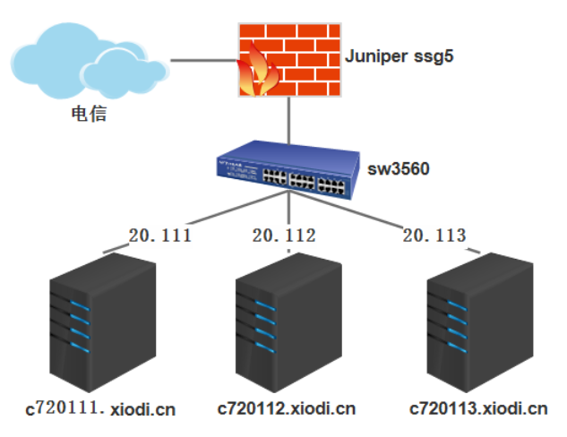

1. 网络拓扑如下


2. 系统环境

|系统   |K8S角色   |IP/主机名   |说明   |
| ------------ | ------------ | ------------ | ------------ |
|Centos 7.7.1908    |Master   | 192.168.20.111/c720111.xiodi.cn  |k8s: v1.17.0   |
|Centos 7.7.1908   |Worker/Node   |192.168.20.112/c720112.xiodi.cn   |   |
|Centos 7.7.1908    |Worker/Node   |192.168.20.113/c720113.xiodi.cn   |   |

3. 部署k8s使用flannel网络插件

```shell
kubectl apply -f https://raw.githubusercontent.com/coreos/flannel/master/Documentation/kube-flannel.yml
```

4. Flannel github地址：https://github.com/coreos/flannel

5. K8S网络模型

Kubernetes对如何连网做出了自已的选择。特别是，Kubernetes对任何网络实现都规定了以下要求。

- 一个pod和其它所有pod间的通信不使用NAT.
- 所有k8s节点和pods通信不使用NAT.
- pod看待自己的IP地址和其它pod看待它是一样的。

有了这些约束，我们就有四个不同的网络问题需要解决有了这些约束，我们就有四个不同的网络问题需要解决。

1. 容器到容器间网络
2. Pod-to-Pod网络
3. Pod-to-Service网络
4. Internet-to-Service网络