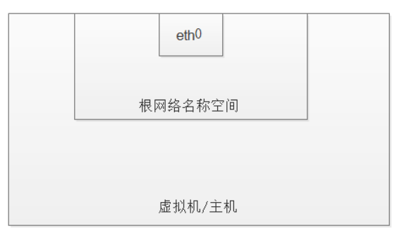
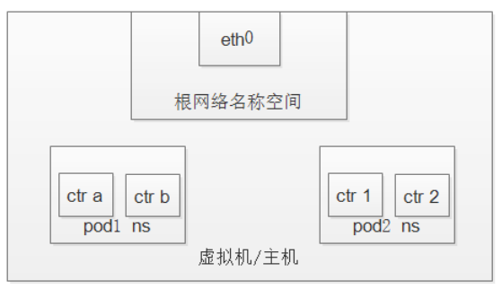

#### 1. 原理篇
通常，我们将虚拟机中的网络通信视为与以太网设备的直接交互.

事实上，情况比这更微妙。在Linux中，每个正在运行的进程在一个网络名称空间内通信，该名称空间提供一个逻辑网络堆栈，其中包含自己的路由、防火墙规则和网络设备。本质上，网络名称空间为该名称空间内的所有进程提供了一个全新的网络堆栈。

1. 创建网络名称空间ns1示例

```shell
$ ip netns add ns1
```

2. 创建名称空间时，将在/var/run/netns下为其创建一个挂载点，即使没有附加任何进程，也允许名称空间保持不变

```shell
$ ls /var/run/netns
$ ip netns
```

3. 默认的，linux分配每个进程到root的名称空间,提供到外部网络的访问。


4. 在Docker构造方面，Pod被建模为一组共享网络名称空间的Docker容器。Pod中的容器都具有通过分配给Pod的网络名称空间分配的相同IP地址和端口空间，并且可以通过localhost彼此查找，因为它们驻留在相同的名称空间中。我们可以为虚拟机上的每个Pod创建一个网络名称空间。这是使用Docker作为“Pod容器”实现的，它保持网络名称空间打开，而“应用程序容器”(用户指定的内容)则将该名称空间与Docker的-net =container:函数连接起来。



#### 2. 实验篇

1. c720113.xiodi.cn和c720112.xiodi.cn两节点上查看网络名称空间。

```shell
[root@c720113 run]# cd /var/run/
[root@c720113 run]# ln -s /var/run/docker/netns netns
[root@c720113 run]# ip netns ls
default
```

2. 部署应用，方便演示

```shell
$ cat two-container.yaml
apiVersion: v1
kind: Pod
metadata:
  name: two-containers
spec:
  restartPolicy: Never
  volumes:
  - name: shared-data
    emptyDir: {}
  containers:
  - name: nginx-container
    image: nginx
    volumeMounts:
    - name: shared-data
      mountPath: /usr/share/nginx/html

  - name: debian-container
    image: debian
    volumeMounts:
    - name: shared-data
      mountPath: /pod-data
    command: ["/bin/sh"]
    args: ["-c", "echo Hello from the debian container > /pod-data/index.html && sleep 3600"]

$ kubectl apply -f two-container.yaml
```


3. 查看pod分配的节点

```shell
[root@c720111 ~]# kubectl get pods -o wide
NAME             READY   STATUS    RESTARTS   AGE    IP           NODE               NOMINATED NODE   READINESS GATES
two-containers   2/2     Running   0          107s   10.244.2.2   c720113.xiodi.cn   <none>           <none>
```

3. 再次在c76087节点查看网络名称空间。

```shell
[root@c720113 run]# ip netns ls
83025ec45b7b (id: 0)
default
```

4. 查看新创建的名称空间下的网卡

```shell
[root@c720113 run]# ip netns exec 83025ec45b7b ip link show
1: lo: <LOOPBACK,UP,LOWER_UP> mtu 65536 qdisc noqueue state UNKNOWN mode DEFAULT group default qlen 1000
    link/loopback 00:00:00:00:00:00 brd 00:00:00:00:00:00
3: eth0@if8: <BROADCAST,MULTICAST,UP,LOWER_UP> mtu 1450 qdisc noqueue state UP mode DEFAULT group default 
    link/ether 32:04:ac:3e:3c:a5 brd ff:ff:ff:ff:ff:ff link-netnsid 0

# 从以上信息可以得出，两个容器使用的是一个网卡，它们彼此之间共享相同的IP地址等信息。接下来，我们通过docker link的方式来进一步的说明
```

5. docker容器使用link方式来共享相同的IP等信息。

```shell
# 启动第一个容器
$ docker run --name web4 -d -P zangxueyuan/web_server_4_redirect

# 启动第二个容器，但网络共享第一个容器的
$ docker run --name web3 -d --net=container:web4 zangxueyuan/web_server_3_8080

# 分别查看两个容器的网络
$ docker exec web4 ip addr show
$ docker exec web3 ip addr show
```