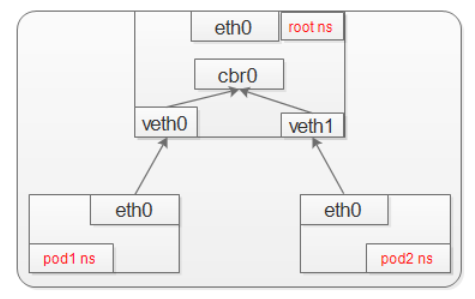
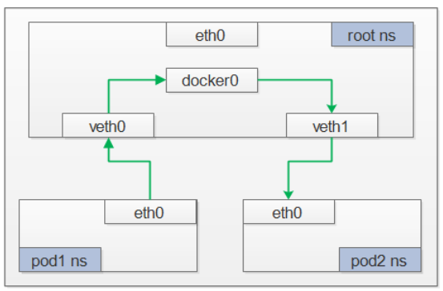
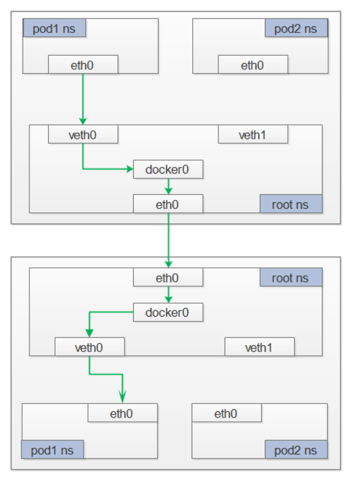

#### 1. 原理篇
Linux以太网桥是虚拟的第二层网络设备，用于联合两个或多个网络段，透明地连接两个网络。网桥的操作方式是，通过检查通过它的数据包的目的地，并决定是否将数据包传递给连接到网桥的其他网络段，从而在源和目的地之间维护一个转发表。桥接代码通过查看网络中每个以太网设备唯一的mac地址来决定是桥接数据还是删除数据。

网桥实现ARP协议来发现与给定IP地址相关联的链路层MAC地址。当一个数据帧在网桥上被接收时，网桥将该帧广播给所有连接的设备(原始发送方除外)，响应该帧的设备被存储在一个查找表中。具有相同IP地址的未来通信量使用查找表来发现要将数据包转发到的正确的MAC地址。


1.1 同一节点包的生命周期：Pod-to-Pod 


1.2 不同节点包的生命周期：pod-to-pod
通常，为集群中的每个节点分配一个CIDR块，指定该节点上运行的pod可用的IP地址。一旦发送到CIDR块的流量到达节点，节点就有责任将流量转发到正确的Pod。图7说明了两个节点之间的流量流，假设网络可以将CIDR块中的流量路由到正确的节点。



#### 2. 实验篇

1. 分别在两个节点上查看网络名称空间。

```shell
[root@c720112 run]# ip netns ls
default

[root@c720113 run]# ip netns ls
default
```

2. 创建应用，方便演示

```shell
# 配置如下所示
[root@c720111 run]# cat web-rs.yaml
apiVersion: apps/v1
kind: ReplicaSet
metadata:
  name: web
spec:
  replicas: 3
  selector:
    matchLabels:
      app: nginx
  template:
    metadata:
      labels:
        app: nginx
    spec:
      containers:
      - name: nginx
        image: zangxueyuan/web_server_1

# 执行以下命令创建
[root@c720111 ~]# kubectl apply -f web-rs.yaml

# 获取Pod的部署信息
[root@c720111 ~]# kubectl get pods -o wide
NAME        READY   STATUS    RESTARTS   AGE    IP           NODE               NOMINATED NODE   READINESS GATES
web-2bgpq   1/1     Running   0          119s   10.244.1.2   c720112.xiodi.cn   <none>           <none>
web-b7ls6   1/1     Running   0          119s   10.244.2.3   c720113.xiodi.cn   <none>           <none>
web-j4fwl   1/1     Running   0          119s   10.244.2.4   c720113.xiodi.cn   <none>           <none>
```

3. 由上面信息可以看出，10.244.2.3和10.244.2.4的两个Pod分配到c720111节点上了。应该创建两个新的网络名称空间，每个下面一个网卡。验证如下

```shell
# 查看网络名称空间
[root@c720112 ~]# ip netns ls
4e93aea16764 (id: 0)
default

[root@c720113 ~]# ip netns ls
7297a108bdef (id: 0)
8fa64c193767 (id: 1)
default

# id为0的网络名称空间下
[root@c720113 ~]# ip netns exec 7297a108bdef ip link show
1: lo: <LOOPBACK,UP,LOWER_UP> mtu 65536 qdisc noqueue state UNKNOWN mode DEFAULT group default qlen 1000
    link/loopback 00:00:00:00:00:00 brd 00:00:00:00:00:00
3: eth0@if9: <BROADCAST,MULTICAST,UP,LOWER_UP> mtu 1450 qdisc noqueue state UP mode DEFAULT group default 
    link/ether 12:1e:de:5d:02:ea brd ff:ff:ff:ff:ff:ff link-netnsid 0

# id为3的网络名称空间下
[root@c720113 ~]# ip netns exec 8fa64c193767 ip link show
1: lo: <LOOPBACK,UP,LOWER_UP> mtu 65536 qdisc noqueue state UNKNOWN mode DEFAULT group default qlen 1000
    link/loopback 00:00:00:00:00:00 brd 00:00:00:00:00:00
3: eth0@if10: <BROADCAST,MULTICAST,UP,LOWER_UP> mtu 1450 qdisc noqueue state UP mode DEFAULT group default 
    link/ether 22:3d:5e:d5:29:0c brd ff:ff:ff:ff:ff:ff link-netnsid 0
```

4. 使用tcpdump进行抓包

```shell
[root@c76085 ~]# kubectl exec web-8wb52 -it -- /bin/sh
# ping 10.244.1.64

[root@c720113 ~]# tcpdump -qnn -i  cni0 dst 10.244.2.4
[root@c720113 ~]# tcpdump -qnn -i  veth4a20051f dst 10.244.2.4
```

5. 不同worker节点的pod通信

```shell
[root@c720113 ~]# tcpdump -qnn -i flannel.1 dst 10.244.2.4
```