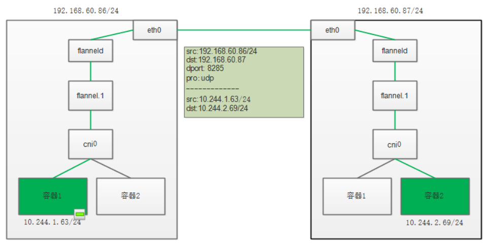

Flannel 项目是 CoreOS 公司主推的容器网络方案。事实上，Flannel 项目本身只是一个框架，真正为我们提供容器网络功能的，是 Flannel 的后端实现。目前，Flannel 支持三种后端实现，分别是：

- VXLAN
- host-gw
- udp

推荐使用VXLAN。对于更有经验的用户，如果他们希望获得性能改进，并且他们的基础设施支持这种改进(通常不能在云环境中使用)，那么建议使用host-gw。UDP建议仅用于调试或不支持VXLAN的非常旧的内核。

UDP 模式，是 Flannel 项目最早支持的一种方式，却也是性能最差的一种方式。所以，这个模式目前已经被弃用。不过，Flannel 之所以最先选择 UDP 模式，就是因为这种模式是最直接、也是最容易理解的容器跨主网络实现。

2. 实验主机如下图所示：

