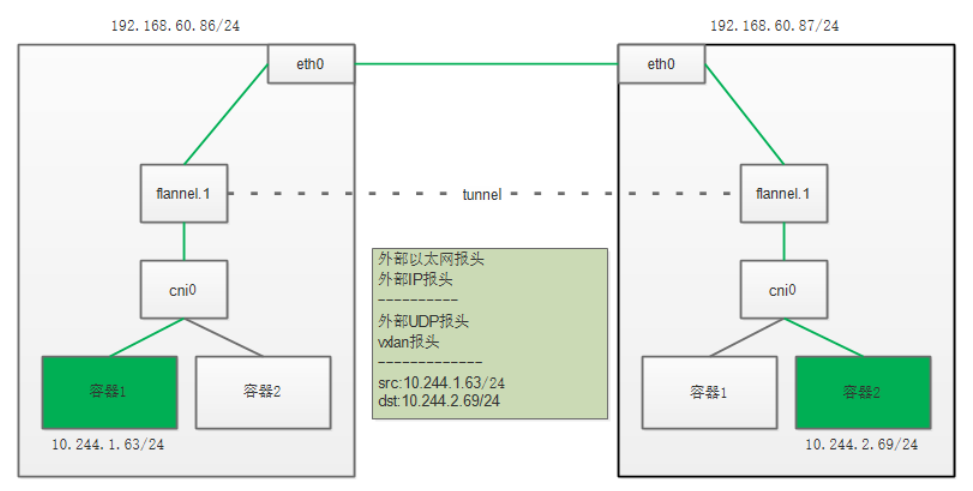
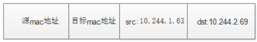

1. vxlan介绍
   虚拟可扩展LAN (VXLAN)是一种网络虚拟化技术，它试图解决与大型云计算部署相关的可伸缩性问题。它使用一种类似于vlan的封装技术，将OSI的第2层以太网帧封装在第4层UDP数据报中，使用4789（windows上），linux上当前默认的是8472端口，作为默认的IANA分配的目标UDP端口号。终止VXLAN隧道的VXLAN端点可以是虚拟的或物理的交换端口，它们被称为VXLAN隧道端点(VTEPs)。

VXLAN 的覆盖网络的设计思想是：在现有的三层网络之上，“覆盖”一层虚拟的、由内核 VXLAN 模块负责维护的二层网络，使得连接在这个 VXLAN 二层网络上的“主机”（虚拟机或者容器都可以）之间，可以像在同一个局域网（LAN）里那样自由通信。当然，实际上，这些“主机”可能分布在不同的宿主机上，甚至是分布在不同的物理机房里

而为了能够在二层网络上打通“隧道”，VXLAN 会在宿主机上设置一个特殊的网络设备作为“隧道”的两端。这个设备就叫作 VTEP，即：VXLAN Tunnel End Point（虚拟隧道端点）。

而 VTEP 设备的作用，其实跟前面的 flanneld 进程非常相似。只不过，它进行封装和解封装的对象，是二层数据帧（Ethernet frame）；而且这个工作的执行流程，全部是在内核里完成的（因为 VXLAN 本身就是 Linux 内核中的一个模块）。


访问流程如下：
1. 容器1的IP10.244.1.63去访问容器2的IP10.244.2.69，它首先会经过cni0网桥，然后再路由到flannel.1设备进行处理。

2. 为了能够将容器1的发送到正确的主机，那么VXLAN就需要找这条通道的出口，即目的主机的VETP设备。

```shell
[root@c720112 run]# ip route 
default via 192.168.20.254 dev eth0 proto static metric 100 
10.244.0.0/24 via 10.244.0.0 dev flannel.1 onlink 
10.244.1.0/24 dev cni0 proto kernel scope link src 10.244.1.1 
10.244.2.0/24 via 10.244.2.0 dev flannel.1 onlink 
```

从上面的路由可以看出，肯定是匹配第三条的，指明应该由flannel.1设备发出，下一跳地址是10.244.2.0，而此IP正好是c720113.xiodi.cn的flannel.1地址。

```shell
[root@c720113 run]# ip address show
6: flannel.1: <BROADCAST,MULTICAST,UP,LOWER_UP> mtu 1450 qdisc noqueue state UNKNOWN group default 
    link/ether 86:ee:f2:6c:ff:32 brd ff:ff:ff:ff:ff:ff
    inet 10.244.2.0/32 scope global flannel.1
       valid_lft forever preferred_lft forever
    inet6 fe80::84ee:f2ff:fe6c:ff32/64 scope link 
       valid_lft forever preferred_lft forever
```

可c720112.xiodi.cn怎么知道10.244.2.0/32的mac地址呢？如下可以看到

```shell
[root@c720112 run]#  ip neigh show dev flannel.1
10.244.1.0 lladdr 1a:8b:21:85:a9:3a PERMANENT
10.244.0.0 lladdr 2a:d1:57:50:83:74 PERMANENT
```

此时，内部的IP包和数据帧就可以封装了。



#### 2. 实验
由于默认就是采用的vxlan模式，所以在这里直接查看。

1. k8s的每个节点都会有cni0,flannel.1

```shell
[root@c720111 run]# ip add show
6: flannel.1: <BROADCAST,MULTICAST,UP,LOWER_UP> mtu 1450 qdisc noqueue state UNKNOWN group default 
    link/ether 1a:8b:21:85:a9:3a brd ff:ff:ff:ff:ff:ff
    inet 10.244.1.0/32 scope global flannel.1
       valid_lft forever preferred_lft forever
    inet6 fe80::188b:21ff:fe85:a93a/64 scope link 
       valid_lft forever preferred_lft forever
7: cni0: <BROADCAST,MULTICAST,UP,LOWER_UP> mtu 1450 qdisc noqueue state UP group default qlen 1000
    link/ether ea:dd:4f:49:f2:6b brd ff:ff:ff:ff:ff:ff
    inet 10.244.1.1/24 scope global cni0
       valid_lft forever preferred_lft forever
    inet6 fe80::e8dd:4fff:fe49:f26b/64 scope link 
       valid_lft forever preferred_lft forever

```

2. 安装抓包工具，查看节点绑定的网桥

```shell
$ yum -y install bridge-utils
$ yum -y install tcpdump
$ brctl show cni0
bridge name	bridge id		STP enabled	interfaces
cni0		8000.3a8e5d2b5d5f	no		vethb4e68784
							vethfd756583
```

3. ping 测试

```shell
[root@c720111 ~]# kubectl exec web-8wb52 -it -- /bin/sh
# ping 10.244.2.69
PING 10.244.2.69 (10.244.2.69): 48 data bytes
56 bytes from 10.244.2.69: icmp_seq=0 ttl=62 time=2.836 ms
56 bytes from 10.244.2.69: icmp_seq=1 ttl=62 time=0.758 ms
```

4. 抓包测试

```shell
# 在cni0网桥抓包
[root@c720112 ~]# tcpdump -i cni0 -nn icmp

# 在flannel.1上抓包
[root@c720112 ~]# tcpdump -i flannel.1 -nn icmp

# 在eth0上抓包
[root@c720112 ~]# tcpdump -i eth0 -nn host 192.168.60.87
```