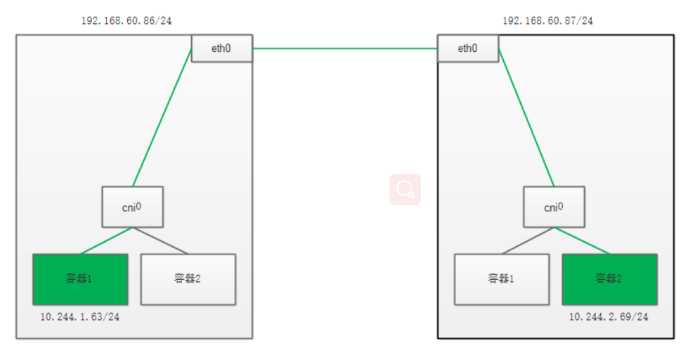

1. 工作原理如下图所示：


假设现在，c76086.xiodi.cn上的容器1，要访问c76087.xiodi.cn 上的容器二。

当你设置 Flannel 使用 host-gw 模式之后，flanneld 会在宿主机上创建这样一条规则，以c76086.xiodi.cn为例：

```shell
$ ip route
...
10.244.2.0/24 via 192.168.60.113 dev eth0
```


#### 2. 实验

1. 删除先前的flannel相关东西，再重新应用下

```shell
[root@c720111 ~]# wget https://raw.githubusercontent.com/coreos/flannel/master/Documentation/kube-flannel.yml
[root@c720111 ~]# kubectl delete -f kube-flannel.yml
[root@c720111 ~]# kubectl apply -f kube-flannel.yml
```

2. 重新部署应用

```shell
$ kubectl apply -f web-rs.yaml
```

3. 在各个节点上查看路由

```shell
[root@c720112 ~]# ip route show
default via 192.168.60.254 dev eth0 proto static metric 100 
10.244.0.0/24 dev cni0 proto kernel scope link src 10.244.0.1 
10.244.1.0/24 via 192.168.60.86 dev eth0 
10.244.2.0/24 via 192.168.60.87 dev eth0 

[root@c720112 run]#  ip route show
default via 192.168.60.254 dev eth0 proto static metric 100 
10.244.0.0/24 via 192.168.60.85 dev eth0 
10.244.1.0/24 dev cni0 proto kernel scope link src 10.244.1.1 
10.244.2.0/24 via 192.168.60.87 dev eth0 

[root@c720112 run]# ip route show
default via 192.168.60.254 dev eth0 proto static metric 100 
10.244.0.0/24 via 192.168.60.85 dev eth0 
10.244.1.0/24 via 192.168.60.86 dev eth0 
10.244.2.0/24 dev cni0 proto kernel scope link src 10.244.2.1 
```