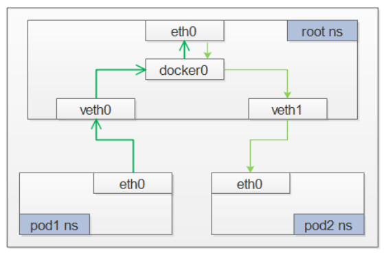

#### 1. Pod到服务间的通信


##### 1.2 IPVS
尽管 Kubernetes 在版本v1.6中已经支持5000个节点，但使用 iptables 的 kube-proxy 实
际上是将集群扩展到5000个节点的瓶颈。 在5000节点集群中使用 NodePort 服务，如
果有2000个服务并且每个服务有10个 pod，这将在每个工作节点上至少产生20000个
iptable 记录，这可能使内核非常繁忙。

ipvs (IP Virtual Server) 实现了传输层负载均衡，也就是我们常说的4层LAN交换，作为Linux 内核的一部分。ipvs运行在主机上，在真实服务器集群前充当负载均衡器。ipvs可以将基于TCP和UDP的服务请求转发到真实服务器上，并使真实服务器的服务在单个IP 地址上显示为虚拟服务。

使用IPVS后是需要对vs进行管理，由于IPVS的DNAT钩子挂在INPUT链上，因此必须要让内核识别VIP(cluster-ip)是本机的IP。k8s 通过设置将
service cluster ip 绑定到虚拟网卡kube-ipvs0，其中下面的10.96.x.x都是VIP，也就是cluster-ip。如下：

```shell
[root@c720112 ~]# ip add show 
5: kube-ipvs0: <BROADCAST,NOARP> mtu 1500 qdisc noop state DOWN group default 
    link/ether 52:7a:7c:05:e3:fa brd ff:ff:ff:ff:ff:ff
    inet 10.96.0.10/32 brd 10.96.0.10 scope global kube-ipvs0
       valid_lft forever preferred_lft forever
    inet 10.96.0.1/32 brd 10.96.0.1 scope global kube-ipvs0
       valid_lft forever preferred_lft forever
    inet 10.96.58.86/32 brd 10.96.58.86 scope global kube-ipvs0
       valid_lft forever preferred_lft forever
6: flannel.1: <BROADCAST,MULTICAST,UP,LOWER_UP> mtu 1450 qdisc noqueue state UNKNOWN group default 
```

ipvs 会使用 iptables 进行包过滤、SNAT、masquared(伪装)。具体来说，ipvs 将使用ipset来存储需要DROP或masquared的流量的源或目标地址，以确保 iptables 规则的数量是恒定的，这样我们就不需要关心我们有多少服务了


##### 1.3 包的生命周期： Pod to Service


流程如下：
1. Pod1通过关联到pod网络名称空间中的eth0离开pod。 
2. 通过vitual ethernet设备到（docker0）网桥。
3. 由于服务的IP和pod的ip不在同一网段，因此会走默认路由。
4. 但把包发送给eth0接口前，包首先要接受iptables的filter表进行过滤。
5. 收到数据包后，iptables使用kube-proxy在节点上安装的响应服务或Pod事件的规则，将数据包的目的地从服务IP改写为特定的Pod IP
6. 该包现在注定要到达Pod 4，而不是服务的虚拟IP。Linux内核的conntrack实用程序被iptables利用来记住所做的Pod选择，以便将来的流量被路由到相同的Pod(排除任何伸缩事件)。实际上，iptables直接在节点上实现了集群内的负载平衡。然后使用我们已经研究过的点对点路由。

##### 1.4 包的生命周期： Service to Pod


接收此包的Pod将进行响应，将源IP标识为自己的IP，将目标IP标识为最初发送该包的Pod,进入节点后，包通过iptables流动，iptables使用conntrack来记住它之前所做的选择，并将包的源重写为服务的IP，而不是Pod的IP.从这里，包通过网桥流向与Pod的名称空间配对的虚拟以太网设备,和我们之前看到的Pod的以太网设备.