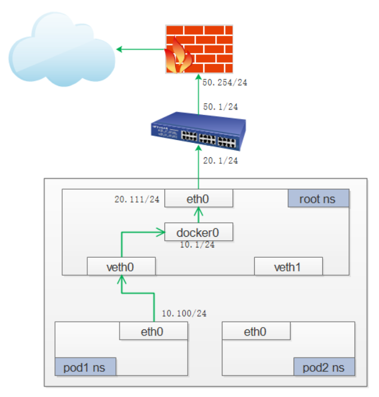

#### 1. Internet-to-Service Networking
到目前为止，我们已经了解了Kubernetes集群中的流量是如何路由的。这一切都很好，但不幸的是，将您的应用程序与外部世界隔离将无助于实现任何销售目标——在某种程度上，您将希望将您的服务公开给外部通信流。这种需求突出了两个相关的问题:(1)从Kubernetes服务获得到Internet的流量，(2)从Internet获得到Kubernetes服务的流量。本节依次处理这些问题。

##### 1.1 Egress - 路由流量到Internet

###### 1.1.1 包的生命周期：Node to Internet

流程如下：
1. 起源于Pod的名称空间数据包通过veth pari连接到根名称空间。
2. 由于包的IP不匹配连接到该网桥上的任何网段，因此它会尝试走默认路由。
3. 但此时中间会有一个Iptables filter表，可以对包进行过滤。但如果我们使用真实的Pod IP. 那么Internet网关将拒绝，因为它只知道节点的IP。因此需要做一个源IP的转换.做这项工作的就是Iptables.
4. 转换成接口的IP地址后，就可以到达Internet网关。
5. 互联网网关将做另一个NAT重写源IP从VM内部IP到外部IP。最后，包将到达公共互联网。
6. 在返回的过程中，包遵循相同的路径，任何对源IP的处理都是未完成的，以便系统的每一层都接收到它所理解的IP地址:节点或VM级别的VM-internal，以及Pod名称空间中的Pod IP。

##### 1.2 Ingress - 路由Internet流量到k8s

