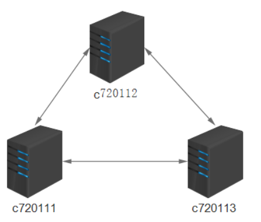

#### 1. BGP协议配置

```shell
apiVersion: projectcalico.org/v3
kind: BGPConfiguration
metadata:
  name: default
spec:
  logSeverityScreen: Info
  nodeToNodeMeshEnabled: true
  asNumber: 63400
  serviceClusterIPs:
  - cidr: 10.96.0.0/12
  serviceExternalIPs:
  - cidr: 192.168.20.99/32
```


#### 2. 关闭默认的BGP node-to-node mesh



缺省的节点到节点的BGP网格必须关闭，以启用其他BGP拓扑。为此，修改默认的BGP配置资源。

- 运行下面的命令去关闭BGP full-mesh

```shell
calicoctl patch bgpconfiguration default -p '{"spec": {"nodeToNodeMeshEnabled":"false"}}'
```

#### 2. 配置全局的 BGP 对等体

- 下面的示例创建一个全局BGP对等点，它将每个Calico节点配置为在AS 64567中使用192.20.30.40的对等点。

```shell
apiVersion: projectcalico.org/v3
kind: BGPPeer
metadata:
  name: my-global-peer
spec:
  peerIP: 192.20.30.40
  asNumber: 64567
```

#### 3. 配置每节点的 BGP peer
每个节点的BGP对等点应用于集群中的一个或多个节点。您可以通过精确地指定节点的名称或使用标签选择器来选择节点。

```shell
apiVersion: projectcalico.org/v3
kind: BGPPeer
metadata:
  name: rack1-tor
spec:
  peerIP: 192.20.30.40
  asNumber: 64567
  nodeSelector: rack == ‘rack-1’
```

#### 4. 配置node作为路由反射器
Calico 可以配置扮演成一个路由反射器。每个节点要充当路由反射器必须有一个集群ID——通常一个未使用的IPv4地址。

- 配置一个节点作为路由反射器，有个集群ID 244.0.0.1， 运行如下命令：

```shell
calicoctl patch node c76085.xiodi.cn -p '{"spec": {“bgp”: {"routeReflectorClusterID": “244.0.0.1”}}}'
```

- 常规情况下，给这个节点打上标签，标明这个是路由反射器。允许它更容易通过BGPPeer resource选择。

```shell
kubectl label node c76085.xiodi.cn route-reflector=true
```

- 现在使用标签器很容易配置路由反射器节点和非路由反射器节点。比如：

```shell
kind: BGPPeer
apiVersion: projectcalico.org/v3
metadata:
  name: peer-with-route-reflectors
spec:
  nodeSelector: all()
  peerSelector: route-reflector == ‘true’
```

- 针对一个节点查看BGP peering 状态
您可以使用calicoctl查看一个特定节点的边界网关协议连接的当前状态。这是用于确认您的配置是根据需要的行为。

```shell
sudo calicoctl node status
```

- 改变默认的global AS number

默认的，所有的calico 节点使用64512 autonomous system, 除非特殊指定。下面的命令把它改成64513.

```shell
calicoctl patch bgpconfiguration default -p '{"spec": {"asNumber": “64513”}}'
```

- 针对特定的节点改变AS number,如下所示

```shell
calicoctl patch node node-1 -p '{"spec": {"bgp": {“asNumber”: “64514”}}}'
```