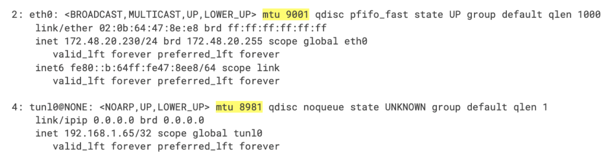

#### 1. 确定MTU的大小
下表针对Calico环境列出了常见的MTU大小。 因为MTU是endpoints间网络路径的全局属性， 你应该设定最低MTU的MTU包可能需要的任何路径。

##### 1.1 常见的MTU大小

|Network MTU   |Calico MTU   |Calico MTU with IP-in-IP (IPv4)   |Calico MTU with VXLAN (IPv4)   |
| ------------ | ------------ | ------------ | ------------ |
|1500   |1500   |1480   |1450   |
|9000   |9000   |8980   |8950   |
|1460(GCE)   |1460   |1440   |1410   |
|9001(AWS jumbo)   |9001   |8981   |8951   |
|1450(OpenStack VXLAN)   |1450   |1430   |1400   |

##### 1.2 针对overlay网络推荐的MTU
额外的报头用于在IP和VXLAN IP协议,降低了最小的MTU大小头。在IP使用20-byte头(IP, VXLAN使用50-byte头)。因此,我们建议如下:

- 如果你使用在Pod网络使用VXLAN,配置MTU大小“物理网络MTU大小- 50”。

- 假如你使用`IP in IP`, 配置MTU大小为“物理网络大小-20”

- workload endpoint MTU和 tunnel MTU设置为相同的值。

##### 1.3 针对flannel网络的MTU

当使用flannel的网络时，网络接口的MTU应该匹配flannel接口的MTU。 假如使用flannel的VXLAN， 使用上面的`calico MTU with VXLAN`列的大小。

#### 2. 配置MTU针对workloads

当你设置MTU,它适用于新工作负载。MTU变化应用于现有的工作负载,必须重新启动calico nodes。

- 编辑calico-config ConfigMap FelixConfiguration设置值。例如:

```shell
kubectl patch configmap/Calico-config -n kube-system --type merge \
  -p '{"data":{"veth_mtu": "1440"}}'
```

#### 3. 针对overlay 网络配置MTU

如果您使用的是IP in IP和/或VXLAN calico overlay 网络,设置隧道MTU匹配veth MTU配置的值。

- 编辑calico-config ConfigMap设置MTU在FelixConfiguration隧道值。例如:

```shell
# Configure the MTU to use
veth_mtu: "1440" 
```

- 查看当前tunnel MTU值

```shell
ip link show
```

IP在IP隧道作为tunlx出现(例如,tunl0),连同MTU大小。例如:
