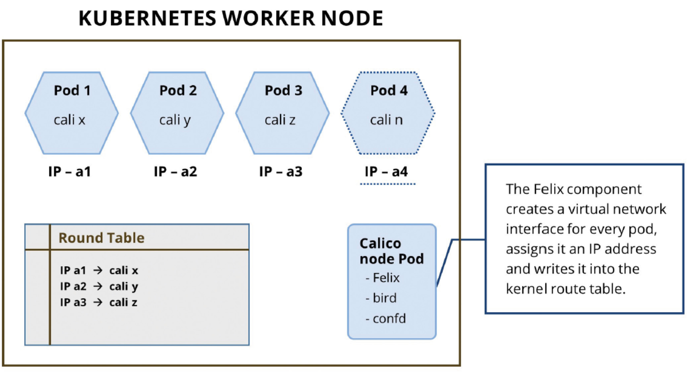

Calico在kubernetes集群中创建和管理一个三层的网络，该网络提供了Pod间的通信。 它为Pods提供了可路由的IP地址，从而使互操作性更加容易。Calico允许实施网络安全策略，提供对pod之间通信的细粒度控制。

#### 1. Calico主要由下列组件组成：

- calico/node: 该agent作为Calico守护进程的一部分运行。它管理接口，路由和接点的状态报告及强制性策略。

- BIRD: 一个BGP的客户端，由Felix程序广播路由。

- Etcd: 一个可选的分布式数据库存储。

- Calico Controller: Calico策略控制器。

##### 1.1 CALICO/NODE:

calico/node是一个由两个容器组成的Pod

1. 一个calico/node容器运行两个守护进程。
a. Felix
b. the Bird BGP daemon (optional)

2. A calico-CNI插件， 响应来自节点上的kubelet的CNI请求。

这个Felix组件是Calico网络的核心。它运行在集群中的每个节点上，它主要负责接口、路由的管理、状态报告及强制性策略。

###### 1.1.1 接口和路由的管理
Felix守护进程负责编程接口并在内核路由表中创建路由，以便在创建pod时为它们提供可路由的IP地址。Felix创建虚拟的网络接口，并且针对每个pod从Calico IPAM中分配一个IP地址。 接口一般以cali前辍开头，除非明确指定

###### 1.1.2 状态报告
Felix通过监视工具(如Prometheus)公开用于实例状态报告的度量。

###### 1.1.3 强制性策略
Felix负责网络策略的实施。Felix监视Pod上的标签，并与定义的网络策略对象进行比较，以决定是否允许或拒绝Pod的流量。Felix将有关接口及其IP地址和主机网络状态的信息写入etcd。



##### 1.2 BIRD
BIRD是一个BGP守护进程，它将Felix编写的路由信息分发给集群节点上的其他BIRD代理。BIRD agent是和Calico守护进程的Pod一起安装的。这确保了流量是跨节点可路由的。默认情况下，Calico创建一个完整的网格拓扑。这意味着每个BIRD代理都需要连接到集群中的其他所有BIRD代理。

对于较大的部署，BIRD可以配置为路由反射器。路由反射器拓扑允许将BIRD设置为其他BIRD代理通信的集中点。它还减少了每个BGP代理打开连接的数量。

##### 1.3 ETCD
Calico使用一个称为etcd的分布式数据存储，存储Calico资源配置和网络策略规则。Felix守护进程与etcd数据存储进行通信，用于发布每个节点的路由、节点和接口信息。

为了获得更高的可用性，应该为大型部署设置多节点etcd集群。在这个设置中，etcd确保在etcd集群中复制Calico配置，使它们始终处于最后已知的良好状态。

一个可选的部署模型是使用Kubernetes API服务器作为分布式数据存储，从而消除了构建和维护etcd数据存储的需要。

#### 2. calico组件协同工作案例演示
在Kubernetes集群上部署三个nginx pod的示例演示了这些组件如何协同工作以提供网络。

1. 当一个nginx pods调度到kubernetes节点上时，Felix创建一个以cali前辍的网络虚拟接口。并且分配给它一个/32的IP地址。

```shell
$ kubectl get pods -o wide
NAME                        READY   STATUS    RESTARTS   AGE     IP               NODE               NOMINATED NODE   READINESS GATES
my-nginx-5d998f947f-dgmrv   1/1     Running   0          102s    10.244.215.169   c720117.xiodi.cn   <none>           <none>
my-nginx-5d998f947f-g8mgj   1/1     Running   2          2d15h   10.244.13.94     c720116.xiodi.cn   <none>           <none>
my-nginx-5d998f947f-gn5hd   1/1     Running   0          102s    10.244.213.164   c720115.xiodi.cn   <none>           <none>
my-nginx-5d998f947f-vb2jb   1/1     Running   0          102s    10.244.220.81    c720114.xiodi.cn   <none>           <none>
```

2. 请注意`my-nginx-5d998f947f-vb2jb`pod是调度到了c720114.xiodi.cn主机上面,且Pod的地址为10.244.220.81。在c720114.xiodi.cn主机上执行如下：

```shell
[root@c720114 ~]# ip route show
default via 192.168.20.1 dev eth0 proto static metric 100 
10.244.13.64/26 via 192.168.20.116 dev tunl0 proto bird onlink 
10.244.106.64/26 via 192.168.20.113 dev tunl0 proto bird onlink 
10.244.117.64/26 via 192.168.20.111 dev tunl0 proto bird onlink 
10.244.123.128/26 via 192.168.20.112 dev tunl0 proto bird onlink 
10.244.213.128/26 via 192.168.20.115 dev tunl0 proto bird onlink 
blackhole 10.244.220.64/26 proto bird 
10.244.220.76 dev cali791e7a948a6 scope link 
10.244.220.77 dev cali1577b57a2a2 scope link 
10.244.220.78 dev calib7e5b49a5fc scope link 
10.244.220.79 dev cali15c7619fccc scope link 
`10.244.220.81 dev cali9ee09c33a93 scope link `
```

3.  查看关于`cali9ee09c33a93`接口的详细信息.

```shell
[root@c720114 ~]# ip a show dev cali9ee09c33a93
13: cali9ee09c33a93@if4: <BROADCAST,MULTICAST,UP,LOWER_UP> mtu 1440 qdisc noqueue state UP group default 
    link/ether ee:ee:ee:ee:ee:ee brd ff:ff:ff:ff:ff:ff link-netnsid 4
    inet6 fe80::ecee:eeff:feee:eeee/64 scope link 
       valid_lft forever preferred_lft forever
```

4. 进入它的容器，应该能看到它的Mac地址和第3步显示的一样。

```shell
[root@c720111 ~]# kubectl exec -it my-nginx-5d998f947f-vb2jb  -- /bin/sh
```

>[info]以上证明了calico创建了网络接口，并分配给Pod一个ip地址。

5. BIRD BGP守护进程意识到出现了一个新的网络接口，并通知其他节点。

我们在其它节点上进行查看如下所示：

```shell
ip route show
default via 192.168.20.1 dev eth0 proto static metric 100 
10.244.13.64/26 via 192.168.20.116 dev tunl0 proto bird onlink 
10.244.106.64/26 via 192.168.20.113 dev tunl0 proto bird onlink 
10.244.117.64/26 via 192.168.20.111 dev tunl0 proto bird onlink 
10.244.123.128/26 via 192.168.20.112 dev tunl0 proto bird onlink 
blackhole 10.244.213.128/26 proto bird 
10.244.213.156 dev cali8739340ad20 scope link 
10.244.213.157 dev cali1abad8afd57 scope link 
10.244.213.158 dev cali11239f98883 scope link 
10.244.213.159 dev cali19a12db9068 scope link 
10.244.213.160 dev cali0ff1fd6ec86 scope link 
10.244.213.161 dev calibf2f53a4925 scope link 
10.244.213.162 dev cali06d2d365420 scope link 
10.244.213.163 dev cali2bb02659332 scope link 
10.244.213.164 dev calidab80719a39 scope link 

`10.244.220.64/26 via 192.168.20.114 dev tunl0 proto bird onlink `

172.17.0.0/16 dev docker0 proto kernel scope link src 172.17.0.1 
192.168.20.0/24 dev eth0 proto kernel scope link src 192.168.20.115 metric 100 
```